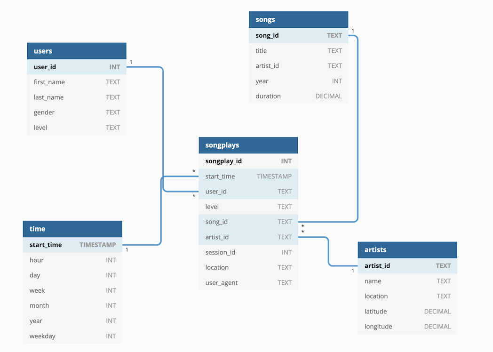

# P2: Data Warehouse

This project comprises the scripts required for setting up a Data Warehouse on a Redshift Cluster for a fictitious Company called Sparkify. This company had been collecting data on user activity from their music streaming application, and storing them as JSON files. However, this rudimentary way of storing data generated some difficulties for extracting insights from the data.

During this project, a Redshift cluster, a database (following a star schema) and its relevant tables were setup. Using this database the Sparkify analytics team will access, aggregate and generate insights from their users’ data.

## Database design

A star schema was selected for building the database, as it simplifies generating queries and can perform fast aggregations. The fact and dimension table are built as follows:




### Fact Table

- Songplays: records in log data associated with song plays. Columns: songplay_id, start_time, user_id, level, song_id, artist_id, session_id, location, user_agent

### Dimension Tables

- Users: users in the app. Columns: user_id (PK), first_name, last_name, gender, level
- Songs: songs in music database. Columns: song_id (PK), title, artist_id, year, duration
- Artists: artists in music database. Columns: artist_id (PK), name, location, latitude, longitude
- Time: timestamps of records in songplays broken down into specific units. Columns: start_time (PK), hour, day, week, month, year, weekday

## How to use

1. Mke sure you set-up the Redshift Cluster, and S3 with the data are setup. 
2. Add the required the credentials to the **dwh.cfg** file. 
3. To build the database and populate the tables, go to the terminal and execute the following in the repository path:

```sh
python create_tables.py
python etl.py
```

This will result in the fact and dimensions tables as specified previously. Now start doing some analytics :)

## Sample queries

```sql
-- Check most popular artists
SELECT name as artist_name, count(songplay_id
FROM songplays s
JOIN artists a ON s.artist_id = a.artist_id
GROUP BY name;

-- Check average length of songs listened by users
SELECT user_id, avg(duration) 
FROM songplays s 
JOIN songs o ON s.song_id = o.song_id 
GROUP BY user_id;
```