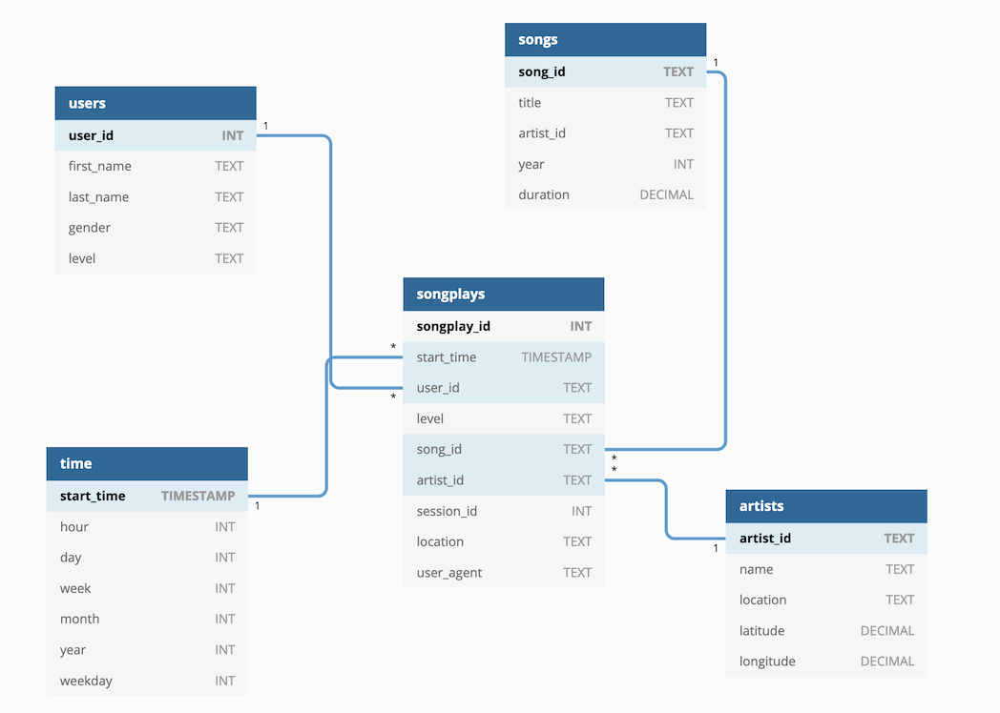

# P3: Data Lake

This project comprises the scripts required for setting up a Data Lake on a using Spark and a S3 bucket. This company had been collecting data on user activity from their music streaming application, and storing them as JSON files. However, this rudimentary way of storing data generated some difficulties when extracting insights from the data.

This directory contains the ETL process, that results in parquet tables following a star schema. Using this tables the Sparkify analytics team will access, aggregate and generate insights from their users’ data.

## Design and tables


The project is structured as following:

```
.
├── README.md (this file)
├── data (sample data used for development)
├── dl.cfg (AWS credentials) 
├── database_schema.jpg (graphical view of the schema of the database)
├── etl.py (python script for generating tables)
├── table_schemas.py (schemas for staging tables) 
└── utils.py (schemas for staging tables) 
```

A star schema was selected for building the tables, saving them as parquet files. The fact and dimension table are built as follows:




### Tables

- Songplays: records in log data associated with song plays. Columns: songplay_id, start_time, user_id, level, song_id, artist_id, session_id, location, user_agent
- Users: users in the app. Columns: user_id (PK), first_name, last_name, gender, level
- Songs: songs in music database. Columns: song_id (PK), title, artist_id, year, duration
- Artists: artists in music database. Columns: artist_id (PK), name, location, latitude, longitude
- Time: timestamps of records in songplays broken down into specific units. Columns: start_time (PK), hour, day, week, month, year, weekday

The tables are saved as parquet files in the S3.


## How to use
 
1. Add the required the credentials to the **dl.cfg** file. 
2. To build the database and populate the tables, go to the terminal and execute the following in the repository path:

```sh
python etl.py
```

This will result in the fact and dimensions tables saved as parquets as specified previously. Now start doing some analytics! :)

## Sample queries

```python
# (This sample code assumes there's an already defined Spark session called "spark")

# Check most popular artists
songplays_table = spark.read.parquet(songplays_table_path)
songplays_table.select("artist_name").groupBy("artist_name").count().sort(col("count").desc())

# What was the average number of songs listened by users?
songplays_table = spark.read.parquet(songplays_table_path)
songplays_table.select("user_id").groupBy("user_id").count().avg()
```