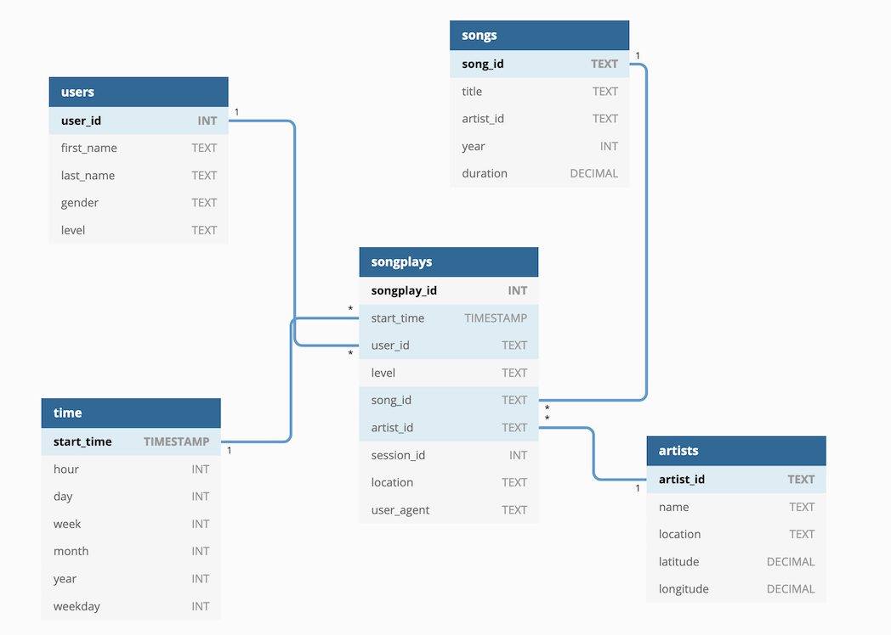

# P4: Data Pipelines

This project comprises the scripts required for setting up a Data Pipeline a using Apache Airflow for Sparkify. This company had been collecting data on user activity from their music streaming application, and storing them as JSON files. However, this rudimentary way of storing data generated some difficulties when extracting insights from the data.

This directory contains the DAGs, helpers, and operators, that processes data coming from an S3 and adds it to a Redshift database. Using this tables the Sparkify analytics team will access, aggregate and generate insights from their users’ data.

## Project structure


The project is structured as following:

```
.
├── README.md (this file)
├── create_tables.sql (SQL queries for creating tables)
├── dags
│   ├── create_tables_dag.py (DAG for creating required tables)
│   └── etl_dag.py (DAG for performing ETL)
└── plugins
    ├── __init__.py
    ├── helpers
    │   ├── __init__.py
    │   └── sql_queries.py (SQL queries for inserting tables)
    └── operators
        ├── __init__.py
        ├── data_quality.py (Operator to peform data quality check)
        ├── execute_query_file.py (Operator to execute a query coming from a file)
        ├── load_dimension.py (Operator to load the Dimensions tables)
        ├── load_fact.py (Operator to load the Fact table)
        └── stage_redshift.py ()
```

## Facts and Dimensions Tables

A star schema was selected for building the tables in the Redshift database. The fact and dimension table are built as follows:



- Songplays: records in log data associated with song plays. Columns: songplay_id, start_time, user_id, level, song_id, artist_id, session_id, location, user_agent
- Users: users in the app. Columns: user_id (PK), first_name, last_name, gender, level
- Songs: songs in music database. Columns: song_id (PK), title, artist_id, year, duration
- Artists: artists in music database. Columns: artist_id (PK), name, location, latitude, longitude
- Time: timestamps of records in songplays broken down into specific units. Columns: start_time (PK), hour, day, week, month, year, weekday

The tables are saved as parquet files in the S3.


## How to use
 
1. Start the Airflow service
2. (Optional) If the tables are not already in place, create them using the Create_tables DAG
3. Start the ETL DAG 

This will result in the fact and dimensions tables as specified previously. Now start doing some analytics! :)

## Sample queries

```sql
-- Check most popular artists
SELECT name as artist_name, count(songplay_id
FROM songplays s
JOIN artists a ON s.artist_id = a.artist_id
GROUP BY name;

-- Check average length of songs listened by users
SELECT user_id, avg(duration) 
FROM songplays s 
JOIN songs o ON s.song_id = o.song_id 
GROUP BY user_id;
```